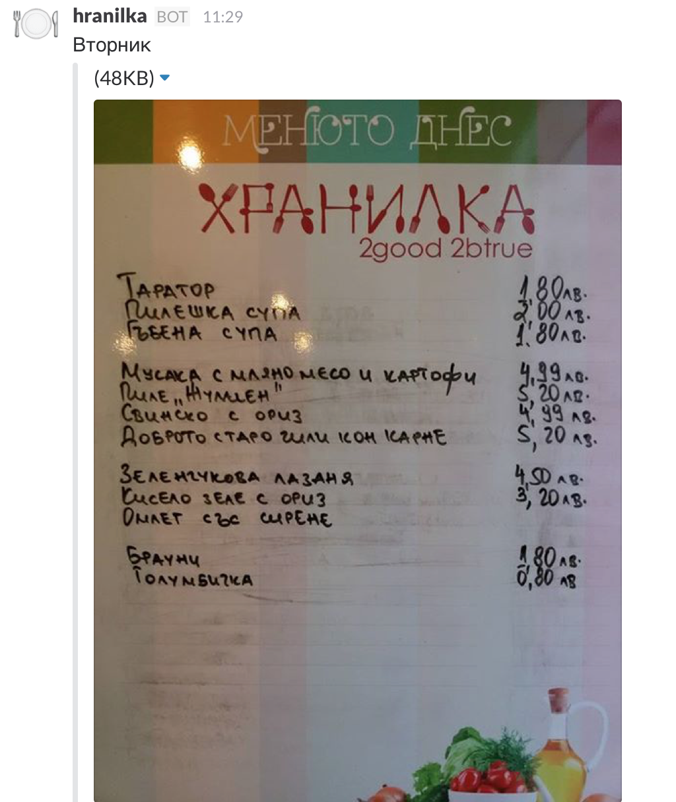

### Hranilka Slack ###

Hranilka-slack is a slack responder for fetching the daily lunch menu of a local (Sofia center) [Food shop](https://www.facebook.com/hranilka/).

#### Usage ####
In slack just use `/hranilka` and you will get the daily menu like this:



#### Running service ####

###### Create a slack webhook ######
Login to your slack account and create a [Incoming Webhook](https://api.slack.com/incoming-webhooks). No specific configuration required, just add a security token to protect it from third party calls.


###### Running the responder #######
```
% FACEBOOK_TOKEN=XXX
% SLACK_TOKEN=XXX
% ruby hranilka.rb
```

`FACEBOOK_TOKEN` - Client Token works fine here since it does not expire and has limited access scope.

`SLACK_TOKEN` - Slack token used to protect the incomming webhook from third party calls.
